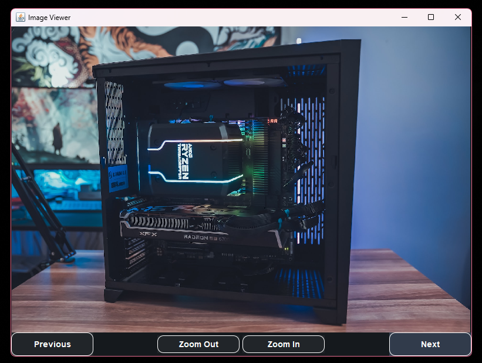

# Image Viewer | IS2

## Overview

The Image Viewer is a simple application developed in Java that allows users to view images from a specified resource folder. The application provides functionalities to navigate through the images, zoom in and out, and slide between images using mouse gestures.

## Features

- **Load Images**: Automatically loads images from the resource folder.
- **Navigation**: Navigate through images using "Next" and "Previous" buttons.
- **Zoom**: Zoom in and out of images using dedicated buttons.
- **Mouse Interaction**: Slide between images using mouse click and drag.

## Usage

1. **Start the Application**: Run the application to open the main window.
	- Images from the resource folder will be loaded automatically.
2. **Navigate**: Use the "Next" and "Previous" buttons to navigate through the images.
3. **Zoom**: Use the "Zoom In" and "Zoom Out" buttons to adjust the image size.
4. **Slide**: Click and drag the mouse to slide between images.

## Screenshots



## Installation

1. Clone the repository:
	```bash
	git clone https://github.com/skinnydevi/is2-image-viewer.git
	```
2. Navigate to the project directory:
	```bash
	cd is2-image-viewer
	```
3. Launch the project using Java and the Main class in `apps.swing.Main`

## Author

- Felix Miguel Velasquez ([@skinnydevi](https://github.com/skinnydevi))
